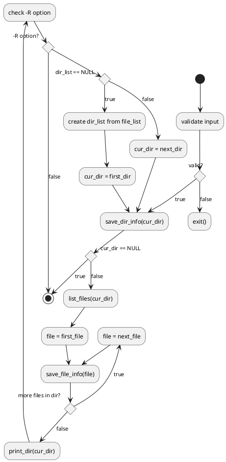

# system-functions

## `<dirent.h>`

| return&nbsp;&nbsp;&nbsp;&nbsp;&nbsp;&nbsp;&nbsp; | name | parameter&nbsp;&nbsp;&nbsp; | description |
| --- | --- | --- | --- |
| `DIR *` | **`opendir`** | `const char *filename` | Opens the directory named by `filename`, associates a directory stream with it and returns a pointer to be used to identify the directory stream in subsequent operations.  The pointer `NULL` is returned if `filename` cannot be accessed, or if it cannot `malloc(3)` enough memory to hold the whole thing, and sets the global variable `errno` to indicate the error. |
| `struct dirent *` | **`readdir`** | `DIR *dirp` | Returns a pointer to the next directory entry.  It returns `NULL` upon reaching the end of the directory or on error.  In the event of an error, `errno` may be set to any of the values documented for the `getdirentries(2)` system call.  Note that the order of the directory entries vended by `readdir()` is not specified. Some file-systems may return entries in lexicographic sort order and others may not. |
| `int` | **`closedir`** | `DIR *dirp` | Closes the named directory stream and frees the structure associated with the `dirp` pointer, returning `0` on success.  On failure, `-1` is returned and the global variable `errno` is set to indicate the error. |

```c
struct dirent {
    ino_t          d_ino;       /* inode number */
    char           d_name[256]; /* filename */
    // OPTIONAL; not supported by all file system types:
    off_t          d_off;       /* offset to the next dirent */
    unsigned short d_reclen;    /* length of this record */
    unsigned char  d_type;      /* type of file */
};
```

## `<sys/stat.h>`

| return | name | parameter&nbsp;&nbsp;&nbsp;&nbsp;&nbsp;&nbsp;&nbsp;&nbsp;&nbsp;&nbsp;&nbsp;&nbsp;&nbsp;&nbsp; | description |
| --- | --- | --- | --- |
| `int` | **`stat`** | `const char *restrict path`,<br>`struct stat *restrict buf` | Obtains information about the file pointed to by `path`.  Read, write or execute permission of the named file is not required, but all directories listed in the `path` name leading to the file must be searchable. |
| `int` | **`lstat`** | `const char *restrict path`,<br>`struct stat *restrict buf` | like `stat()` except in the case where the named file is a symbolic link; `lstat()` returns information about the link, while `stat()` returns information about the file the link references.  For symbolic links, the `st_mode` member contains meaningful information when used with the file type macros, and the `st_size` member contains the length of the pathname contained in the symbolic link. File mode bits and the contents of the remaining members of the stat structure are unspecified. The value returned in the `st_size` member is the length of the contents of the symbolic link, and does not count any trailing null. |

```c
struct stat { /* when _DARWIN_FEATURE_64_BIT_INODE is NOT defined */
    dev_t    st_dev;    /* device inode resides on */
    ino_t    st_ino;    /* inode's number */
    mode_t   st_mode;   /* inode protection mode */
    nlink_t  st_nlink;  /* number of hard links to the file */
    uid_t    st_uid;    /* user-id of owner */
    gid_t    st_gid;    /* group-id of owner */
    dev_t    st_rdev;   /* device type, for special file inode */
    struct timespec st_atimespec;  /* time of last access */
    struct timespec st_mtimespec;  /* time of last data modification */
    struct timespec st_ctimespec;  /* time of last file status change */
    off_t    st_size;   /* file size, in bytes */
    quad_t   st_blocks; /* blocks allocated for file */
    u_long   st_blksize;/* optimal file sys I/O ops blocksize */
    u_long   st_flags;  /* user defined flags for file */
    u_long   st_gen;    /* file generation number */
};
```

## `<uuid/uuid.h>`

| return | name | parameter&nbsp; | description |
| --- | --- | --- | --- |
| `struct passwd *` | **`getpwuid`** | `uid_t uid` | Search the password database for the given user `uid`, always returning the first one encountered. |
| `struct group *` | **`getgrid`** | `gid_t gid` | Search the group database for the given group id `gid`, returning the first one encountered.  Identical group gids may result in undefined behavior. |

```c
struct passwd {
    char    *pw_name;       /* user name */
    char    *pw_passwd;     /* encrypted password */
    uid_t   pw_uid;         /* user uid */
    gid_t   pw_gid;         /* user gid */
    time_t  pw_change;      /* password change time */
    char    *pw_class;      /* user access class */
    char    *pw_gecos;      /* Honeywell login info */
    char    *pw_dir;        /* home directory */
    char    *pw_shell;      /* default shell */
    time_t  pw_expire;      /* account expiration */
    int     pw_fields;      /* internal: fields filled in */
};
```

```c
struct group {
    char    *gr_name;       /* group name */
    char    *gr_passwd;     /* group password */
    gid_t   gr_gid;         /* group id */
    char    **gr_mem;       /* group members */
};
```

## `<sys/xattr.h>`

Extended attributes extend the basic attributes associated with files and directories in the file system.  They are stored as name:data pairs associated with file system objects (files, directories, symlinks, etc).

| return | name |  parameter&nbsp;&nbsp;&nbsp;&nbsp;&nbsp;&nbsp;&nbsp;&nbsp;&nbsp;&nbsp;&nbsp;&nbsp;&nbsp;&nbsp;&nbsp;&nbsp;&nbsp;&nbsp;&nbsp;&nbsp;&nbsp;&nbsp;&nbsp;&nbsp;  | description |
| --- | --- | --- | --- |
| `ssize_t` | **`listxattr`** | `const char *path`,<br>`char *namebuf`,<br>`size_t size`,<br>`int options` | Retrieves a list of names of extended attributes associated with the given `path` in the file system. |
| `ssize_t` | **`getxattr`** | `const char *path`,<br>`const char *name`,<br>`void *value`,<br>`size_t size`,<br>`u_int32_t position`,<br>`int options` | Retrieves up to `size` bytes of data from the extended attribute identified by name associated with `path` into the pre-allocated buffer pointed to by `value`.  The function returns the number of bytes of data retrieved. |


## `<time.h>`

| return | name | parameter&nbsp;&nbsp;&nbsp;&nbsp;&nbsp;&nbsp;&nbsp;&nbsp;&nbsp;&nbsp;&nbsp;&nbsp;&nbsp;&nbsp;&nbsp;&nbsp;&nbsp;&nbsp;&nbsp;&nbsp;&nbsp;&nbsp;&nbsp;&nbsp; | description |
| --- | --- | --- | --- |
| `time_t` | **`time`** | `time_t *tloc` | Returns the value of time in seconds since 0 hours, 0 minutes, 0 seconds, January 1, 1970, Coordinated Universal Time, without including leap seconds.  If an error occurs, `time()` returns the value `(time_t)-1`. |
| `char *` | **`ctime`** | `const time_t *clock` | Takes as an argument a time value representing the time in seconds since the Epoch (00:00:00 UTC, January 1, 1970; see time(3)).  When encountering an error, this function returns `NULL` and sets `errno` to an appropriate value. It returns a pointer to a 26-character string of the form: "Thu Nov 24 18:22:48 1986\n"


## `<unistd.h>`

| return | name | parameter&nbsp;&nbsp;&nbsp;&nbsp;&nbsp;&nbsp;&nbsp;&nbsp;&nbsp;&nbsp;&nbsp;&nbsp;&nbsp;&nbsp;&nbsp;&nbsp;&nbsp;&nbsp;&nbsp;&nbsp;&nbsp;&nbsp;&nbsp; | description |
| --- | --- | --- | --- |
| `ssize_t` | **`readlink`** | `const char *restrict path`,<br>`char *restrict buf`,<br>`size_t bufsize` | Places the contents of the symbolic link `path` in the buffer `buf`, which has size `bufsize`. Readlink does not append a NUL character to `buf`. |

## `<stdio.h>`

| return&nbsp;&nbsp; | name | parameter | description |
| --- | --- | --- | --- |
| `void` | **`perror`** | `const char *s` | Finds the error message corresponding to the current value of the global variable `errno` (intro(2)) and writes it, followed by a newline, to the standard error file descriptor. If the argument `s` is non-NULL and does not point to the null character, this string is prepended to the message string and separated from it by a colon and space (``: ''); otherwise, only the error message string is printed. |
| `char *` | **`strerror`** | `int errnum` | Looks up the error message string corresponding to the error number `errnum` and returns a pointer to the corresponding message string. |


# options

- `-l`  
List in long format.  (See below.)  If the output is to a terminal, a total sum for all the file sizes is output on a line before the long listing.
- `-R`  
Recursively list subdirectories encountered.
- `-a`  
Include directory entries whose names begin with a dot (.).
- `-r`  
Reverse the order of the sort to get reverse lexicographical order or the oldest entries first.
- `-t`  
Sort by time modified (most recently modified first) before sorting the operands by lexicographical order.
- `-u` (bonus)  
Use time of last access, instead of last modification of the file for sorting (-t) or long printing (-l).
- `-g` (bonus)  
This option is only available for compatibility with POSIX; it is used to display the group name in the long (-l) format output (the owner name is suppressed).
- `-d` (bonus)  
Directories are listed as plain files (and not searched recursively).
- `-S` (bonus)  
Sort files by size
- `-s` (bonus)
Display the number of file system blocks actually used by each file, in units of 512 bytes, where partial units are rounded up to the next integer value.  If the output is to a terminal, a total sum for all the file sizes is output on a line before the listing.  The environment variable BLOCKSIZE overrides the unit size of 512 bytes.

